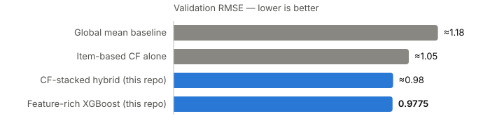

# Yelp Hybrid Recommender

Predicting the star rating a user will give a business on the Yelp dataset —
**best validation RMSE 0.9775** on ~142k held-out user–business pairs, under a
strict single-core runtime budget (~100 s end-to-end including training).

<picture>
  <source media="(prefers-color-scheme: dark)" srcset="assets/rmse-dark.svg">
  
</picture>

The repo contains two models (PySpark + XGBoost) that test opposite answers to
one question: **given a fixed compute budget, is it better spent on a smarter
collaborative-filtering stage, or on a richer feature set?**

| | `cf_stacked_recommender.py` | `feature_rich_recommender.py` |
|---|---|---|
| Architecture | Two-stage stack: item-based CF → XGBoost | Single-stage XGBoost |
| CF signal | Real item-based Pearson CF, fed in via 5-fold out-of-fold stacking | Fast bias proxy (`user_avg + biz_avg − global_avg`) |
| Features | 68 | ~120 |
| Leakage control | OOF CF predictions | Leave-one-out per-row training statistics |
| Calibration | Clamp to [1, 5] | Validation-tuned expansion around the global mean, then clamp |
| Runtime (single core) | Minutes (dominated by pairwise similarities) | ~100 s |
| Validation RMSE | 0.9865 | **0.9775** |

**The answer, under this budget: features won.** Dropping the expensive CF
stage to a cheap bias proxy and reinvesting the runtime in ~50 more features,
leave-one-out leakage control, and output calibration beat the architecturally
fancier stack. The two are not a controlled ablation — the feature-rich model
changes several things at once — but the direction was consistent across the
tuning history.

## What moved the needle

Roughly in order of impact during development:

1. **User/business bias features** carry most of the signal: smoothed averages
   take the global-mean baseline from 1.1222 to around ~1.0 on their own.
2. **Leave-one-out training statistics.** A user with three ratings has a raw
   average that is one-third the target itself — the model happily overfits to
   that leak. Subtracting each training row's own rating from its user's and
   business's average/variance/min/max/rate features gave a measurable RMSE
   gain and cost nothing at inference (test rows use full statistics).
3. **Rating-distribution features** — per user and business, the fraction of
   ratings that are ≤2, ≥4, exactly 1, exactly 5, plus cross terms. A
   harsh-rater × polarizing-business interaction is very predictive of 1-star
   outcomes.
4. **Bayesian smoothing toward profile priors.** User/business averages are
   shrunk toward their Yelp JSON profile stars (at several shrinkage
   constants), so sparse entities degrade toward an informative prior rather
   than the global mean, with explicit cold-start flags.
5. **Output calibration.** The raw model is conservative at the extremes;
   linearly expanding predictions around the global mean (factor tuned on
   validation) recovered a final slice of RMSE.
6. **CF stacking** (Model 1): feeding the CF prediction to XGBoost as a
   feature with 9 derivatives — neighbor count, confidence, residuals vs.
   user/business baselines — beat a fixed CF/model blend weight, because the
   trees learn *when* CF is trustworthy.

Error distribution at RMSE 0.9775 (~142k validation pairs): 102,919 within 1
star, 32,034 within 1–2, 6,169 within 2–3, 922 above 3.

## The two models

### `cf_stacked_recommender.py` — the architecture play

Classic item-based CF (Pearson over co-raters, significance weighting
`min(n, 50)/50`, case amplification `sim·|sim|^1.5`, top-50 neighborhood with a
bias fallback when thin) stacked into XGBoost. The stacking is **out-of-fold**:
training rows get CF predictions from a 5-fold scheme where each row is
predicted by a CF model that never saw it — without this, the second stage
learns to trust CF far more than it deserves at test time.

### `feature_rich_recommender.py` — the feature play

Single XGBoost regressor (hyperparameters tuned with Bayesian optimization)
over ~120 features: everything above plus business attributes (alcohol, noise
level, attire, wifi…), weekly opening hours, evening/weekend checkin ratios,
tip/photo engagement, top-24 category indicators, and bias × confidence ×
price cross features. The CF feature slots are filled by the non-leaky bias
proxy so the whole pipeline fits the single-core budget.

**Natural next step:** the two strengths are orthogonal — restoring the OOF CF
stack inside the feature-rich model (where runtime isn't capped) and re-tuning
should beat both.

## Usage

Requires the [Yelp Open Dataset](https://www.yelp.com/dataset) files
(`yelp_train.csv` with `user_id,business_id,stars`, plus `user.json`,
`business.json`, `checkin.json`, `tip.json`, `photo.json`) in one folder.

```bash
pip install -r requirements.txt

spark-submit feature_rich_recommender.py ./data ./data/yelp_val_in.csv output.csv
spark-submit cf_stacked_recommender.py   ./data ./data/yelp_val_in.csv output.csv
```

Output is a CSV with `user_id,business_id,prediction`.
