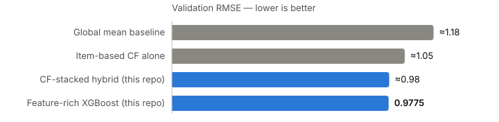

# Yelp Hybrid Recommender

Given a Yelp user and a business, predict how many stars (1–5) that user will
give that business. **Best validation RMSE: 0.9775** on 142,044 held-out
user–business pairs. It runs end-to-end, including all training, in ~100 s.

## The problem

The goal is a recommender that predicts ratings for (user, business) pairs it
has never seen. It learns from a subset of Yelp reviews and is scored on a
hidden test set.

In concrete terms:

- **Input:** a CSV of `user_id,business_id` pairs.
- **Output:** a CSV of `user_id,business_id,prediction`, where `prediction`
  is a real-valued star rating.
- **Metric:** root mean squared error (RMSE) between predicted and true stars.
  Lower is better. Because the errors are squared, a prediction that is 3 stars
  off costs nine times as much as one that is 1 star off. If you predict the
  global average (3.75 stars) for every pair, you get an RMSE of 1.1222.
- **Target:** the benchmark to beat was an RMSE of **0.9800**.

### The data

The data is a filtered subset of the [Yelp Open Dataset](https://www.yelp.com/dataset).
Reviews were randomly split 60% / 20% / 20% into train, validation and a hidden
test set.

| File | Contents |
|---|---|
| `yelp_train.csv` | 455,854 ratings, with only three columns: `user_id, business_id, stars` |
| `yelp_val.csv` | 142,044 ratings in the same format, used for local evaluation |
| `user.json` | User profiles: review count, lifetime average stars, fans, friends, elite years, compliments, votes |
| `business.json` | Business profiles: average stars, location, categories, attributes (price, noise level, wifi…), opening hours |
| `checkin.json`, `tip.json`, `photo.json` | Engagement data: check-in times, short tips, photo counts |
| `review_train.json` | Full review text for the training pairs (not used by these models) |

A few properties of the data drive most of the design choices:

- **It's very sparse.** The training set covers 11,270 users and 24,732
  businesses, but only about 0.16% of possible user–business pairs have a
  rating. Most of what a model knows about a pair has to come from each side's
  overall tendencies, not from overlap with similar users.
- **Businesses have a long tail.** Every user has at least 18 training
  ratings, but the median business has 11 and 14% of businesses have 3 or
  fewer. 307 validation pairs (0.2%) involve a business that doesn't appear in
  training at all. For those, the model falls back on side data such as the
  business's profile stars.
- **Ratings skew positive.** 65% of ratings are 4 or 5 stars and only 5% are 1
  star, so the hard cases are the rare, very negative ones.

### The constraints

The rules of the setup shaped the engineering as much as the data did:

- **Spark RDDs only** for data processing: no Spark DataFrames or SQL. Python
  3.6, Spark 3.1.2.
- **One self-contained script, trained from scratch on every run.** Submitting
  pre-trained models was not allowed, so feature building and model fitting
  happen inside the scored run.
- **Hard time limit:** a run that took longer than 25 minutes scored zero.
  Expensive steps, such as pairwise similarity computation, compete for time
  with everything else.

## Results

<picture>
  <source media="(prefers-color-scheme: dark)" srcset="assets/rmse-dark.svg">
  
</picture>

The repo contains two models (PySpark + XGBoost) that test opposite answers to
one question: **given a fixed compute budget, is it better spent on a smarter
collaborative-filtering stage, or on a richer feature set?**

| | `cf_stacked_recommender.py` | `feature_rich_recommender.py` |
|---|---|---|
| Architecture | Two-stage stack: item-based CF → XGBoost | Single-stage XGBoost |
| CF signal | Real item-based Pearson CF, fed in via 5-fold out-of-fold stacking | Fast bias proxy (`user_avg + biz_avg − global_avg`) |
| Features | 68 | ~120 |
| Leakage control | OOF CF predictions | Leave-one-out per-row training statistics |
| Calibration | Clamp to [1, 5] | Validation-tuned expansion around the global mean, then clamp |
| Runtime (single core) | Minutes (dominated by pairwise similarities) | ~100 s |
| Validation RMSE | 0.9865 | **0.9775** |

**The answer, under this budget: features won.** Dropping the expensive CF
stage to a cheap bias proxy and reinvesting the runtime in ~50 more features,
leave-one-out leakage control, and output calibration beat the architecturally
fancier stack. The two are not a controlled ablation — the feature-rich model
changes several things at once — but the direction was consistent across the
tuning history.

All RMSEs here are on the public validation split. The hidden test-set
scores aren't reported in this repo.

### Terms used below

- **Collaborative filtering (CF):** predicting a rating from other ratings.
  *Item-based* CF estimates how a user will rate business B from how that same
  user rated businesses similar to B. Two businesses count as similar when the
  same people tend to rate them the same way.
- **Bias / baseline:** how much a user rates above or below average (a harsh
  or generous rater), plus how much a business is rated above or below average.
  The sum of the two is a surprisingly strong predictor on its own.
- **Target leakage:** a feature that quietly contains the answer during
  training but not at prediction time. The model looks great in training and
  worse on new data.
- **Stacking / out-of-fold (OOF):** feed one model's predictions into a second
  model as a feature. The training predictions come from copies of the first
  model that never saw those rows. Otherwise the second model learns to trust
  the first model's overconfident, leaky training predictions.
- **Cold start:** a user or business with few or no training ratings.

## What moved the needle

Roughly in order of impact during development:

1. **User/business bias features** carry most of the signal: smoothed averages
   take the global-mean baseline from 1.1222 to around ~1.0 on their own.
2. **Leave-one-out training statistics.** A business with three ratings has a
   raw average that is one-third the target itself — the model happily overfits
   to that leak. Subtracting each training row's own rating from its user's and
   business's average/variance/min/max/rate features gave a measurable RMSE
   gain and cost nothing at inference (test rows use full statistics).
3. **Rating-distribution features** — per user and business, the fraction of
   ratings that are ≤2, ≥4, exactly 1, exactly 5, plus cross terms. A
   harsh-rater × polarizing-business interaction is very predictive of 1-star
   outcomes.
4. **Bayesian smoothing toward profile priors.** User/business averages are
   shrunk toward their Yelp JSON profile stars (at several shrinkage
   constants), so sparse entities degrade toward an informative prior rather
   than the global mean, with explicit cold-start flags.
5. **Output calibration.** The raw model is conservative at the extremes;
   linearly expanding predictions around the global mean (factor tuned on
   validation) recovered a final slice of RMSE.
6. **CF stacking** (Model 1): feeding the CF prediction to XGBoost as a
   feature with 9 derivatives — neighbor count, confidence, residuals vs.
   user/business baselines — beat a fixed CF/model blend weight, because the
   trees learn *when* CF is trustworthy.

Error distribution at RMSE 0.9775 (~142k validation pairs): 102,919 within 1
star, 32,034 within 1–2, 6,169 within 2–3, 922 above 3.

## The two models

### `cf_stacked_recommender.py` — the architecture play

Classic item-based CF (Pearson over co-raters, significance weighting
`min(n, 50)/50`, case amplification `sim·|sim|^1.5`, top-50 neighborhood with a
bias fallback when thin) stacked into XGBoost. The stacking is **out-of-fold**:
training rows get CF predictions from a 5-fold scheme where each row is
predicted by a CF model that never saw it — without this, the second stage
learns to trust CF far more than it deserves at test time.

### `feature_rich_recommender.py` — the feature play

Single XGBoost regressor (hyperparameters tuned with Bayesian optimization)
over ~120 features: everything above plus business attributes (alcohol, noise
level, attire, wifi…), weekly opening hours, evening/weekend checkin ratios,
tip/photo engagement, top-24 category indicators, and bias × confidence ×
price cross features. The CF feature slots are filled by the non-leaky bias
proxy so the whole pipeline fits the single-core budget.

**Natural next step:** the two strengths are orthogonal — restoring the OOF CF
stack inside the feature-rich model (where runtime isn't capped) and re-tuning
should beat both.

## Usage

Needs the data files described [above](#the-data), all in one folder.
`yelp_train.csv` and `yelp_val.csv` are custom splits and aren't part of the
public Yelp release. The data isn't redistributable, so it
isn't included in this repo.

```bash
pip install -r requirements.txt

spark-submit feature_rich_recommender.py ./data ./data/yelp_val.csv output.csv
spark-submit cf_stacked_recommender.py   ./data ./data/yelp_val.csv output.csv
```

The test file only needs `user_id,business_id` columns. Any extra columns,
such as `stars` in `yelp_val.csv`, are ignored. The output is a CSV with
`user_id,business_id,prediction`.
